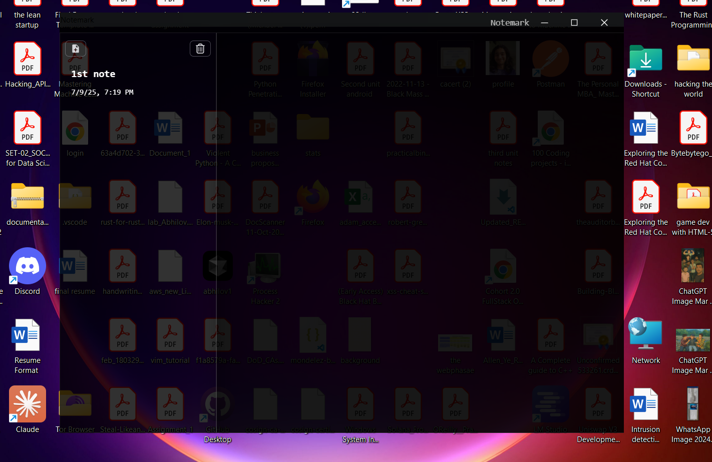

# Notemark

A beautiful, modern note-taking application built with Electron, React, and TypeScript. Features a sleek glass morphism design with real-time markdown editing capabilities.



## Features

- **📝 Markdown Editor** - Rich markdown editing with live preview
- **🎨 Glass Morphism UI** - Modern, transparent design with backdrop blur effects
- **⚡ Real-time Auto-save** - Automatic saving every 3 seconds while typing
- **🗂️ File Management** - Create, delete, and organize your notes
- **🔍 Quick Access** - Sidebar with note previews and timestamps
- **🖥️ Cross-platform** - Works on Windows, macOS, and Linux
- **🪟 Custom Window Controls** - Minimize, maximize, and close buttons
- **🌙 Dark Theme** - Elegant dark interface optimized for extended use

## Tech Stack

- **Frontend**: React 18 with TypeScript
- **Desktop Framework**: Electron
- **State Management**: Jotai
- **Styling**: Tailwind CSS
- **Markdown Editor**: MDX Editor
- **Build Tool**: Vite
- **Icons**: React Icons

## Installation

### Prerequisites

- Node.js (v16 or higher)
- npm or yarn

### Clone and Install

```bash
# Clone the repository
git clone https://github.com/yourusername/notemark.git
cd notemark

# Install dependencies
npm install

# Start the development server
npm run dev
```

### Building for Production

```bash
# Build for your current platform
npm run build

# Build for specific platforms
npm run build:win    # Windows
npm run build:mac    # macOS
npm run build:linux  # Linux
```

## Usage

### Creating Notes

1. Click the "+" button in the sidebar to create a new note
2. Choose a filename and location in the file dialog
3. Start typing in the markdown editor

### Editing Notes

- Click on any note in the sidebar to open it
- The editor supports standard markdown syntax
- Changes are automatically saved every 3 seconds
- Manual save occurs when you click outside the editor

### Organizing Notes

- Notes are automatically sorted by last edit time
- Delete notes using the trash icon in the sidebar
- Notes are stored as `.md` files in your `~/NoteMark` directory

### Keyboard Shortcuts

- **Ctrl/Cmd + N** - Create new note
- **Ctrl/Cmd + S** - Save current note
- **Ctrl/Cmd + W** - Close current note
- **Ctrl/Cmd + Q** - Quit application

## File Structure

```
notemark/
├── src/
│   ├── main/                 # Electron main process
│   │   ├── index.ts         # Main application entry
│   │   └── lib/             # File system operations
│   ├── preload/             # Preload scripts
│   │   └── index.ts         # IPC bridge
│   ├── renderer/            # React frontend
│   │   ├── src/
│   │   │   ├── components/  # React components
│   │   │   ├── hooks/       # Custom React hooks
│   │   │   └── store/       # Jotai state management
│   │   └── store/           # Application state
│   └── shared/              # Shared types and constants
├── resources/               # App icons and assets
└── package.json
```

## Configuration

### Default Settings

- **Auto-save interval**: 3 seconds
- **File encoding**: UTF-8
- **Default directory**: `~/NoteMark`
- **File extension**: `.md`

### Customization

You can modify these settings in `src/shared/constants.ts`:

```typescript
export const appDirectoryName = 'NoteMark'
export const fileEncoding = 'utf8'
export const autoSavingTime = 3000 // milliseconds
```

## Development

### Project Setup

```bash
# Install dependencies
npm install

# Start development server
npm run dev

# Run linting
npm run lint

# Format code
npm run format
```

### Architecture

The application follows a clean architecture pattern:

- **Main Process**: Handles file system operations and window management
- **Preload Script**: Provides secure IPC bridge between main and renderer
- **Renderer Process**: React application with component-based architecture
- **State Management**: Jotai atoms for reactive state management

### Adding New Features

1. **File Operations**: Add new functions to `src/main/lib/index.ts`
2. **UI Components**: Create components in `src/renderer/src/components/`
3. **State Management**: Add atoms to `src/renderer/store/index.ts`
4. **Types**: Define interfaces in `src/shared/types.ts`

## Contributing

1. Fork the repository
2. Create a feature branch (`git checkout -b feature/amazing-feature`)
3. Commit your changes (`git commit -m 'Add some amazing feature'`)
4. Push to the branch (`git push origin feature/amazing-feature`)
5. Open a Pull Request

### Development Guidelines

- Follow TypeScript best practices
- Use ESLint and Prettier for code formatting
- Write descriptive commit messages
- Add tests for new features
- Update documentation as needed

## Security

- **Context Isolation**: Enabled for secure IPC communication
- **Node Integration**: Disabled in renderer process
- **Sandboxing**: Enabled for enhanced security
- **CSP**: Content Security Policy configured

## Troubleshooting

### Common Issues

**Notes not saving:**
- Check if the `~/NoteMark` directory exists and is writable
- Verify file permissions
- Check console for error messages

**App won't start:**
- Ensure Node.js version is 16 or higher
- Clear node_modules and reinstall dependencies
- Check for conflicting global packages

**Performance issues:**
- Reduce auto-save frequency in constants.ts
- Close unused notes
- Restart the application

### Getting Help

- Check the [Issues](https://github.com/yourusername/notemark/issues) page
- Review the [Documentation](https://github.com/yourusername/notemark/wiki)
- Join our [Discord Community](https://discord.gg/notemark)

## License

This project is licensed under the MIT License - see the [LICENSE](LICENSE) file for details.

## Acknowledgments

- [Electron](https://electronjs.org/) - Cross-platform desktop framework
- [MDX Editor](https://mdxeditor.dev/) - Markdown editing component
- [Jotai](https://jotai.org/) - State management library
- [Tailwind CSS](https://tailwindcss.com/) - Utility-first CSS framework
- [React Icons](https://react-icons.github.io/react-icons/) - Icon library

## Roadmap

- [ ] Note templates
- [ ] Dark/Light theme toggle
- [ ] Export to PDF/HTML
- [ ] Plugin system
- [ ] Cloud synchronization
- [ ] Mobile companion app
- [ ] Advanced search functionality
- [ ] Note categories/tags
- [ ] Collaborative editing

---

**Made with ❤️ by Abhilov**

*If you find this project helpful, please consider giving it a ⭐ on GitHub!*